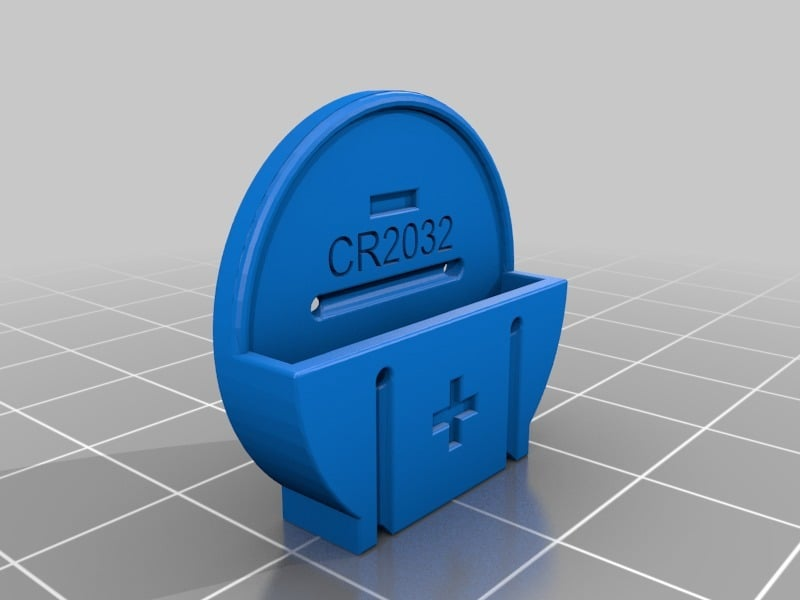
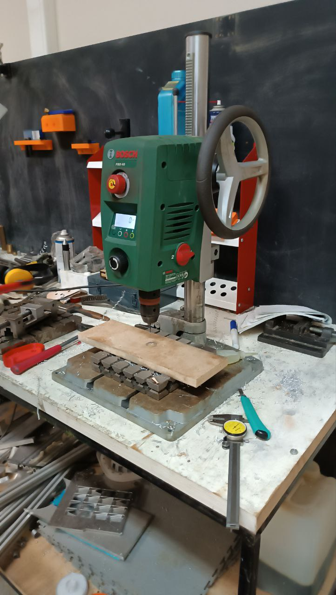
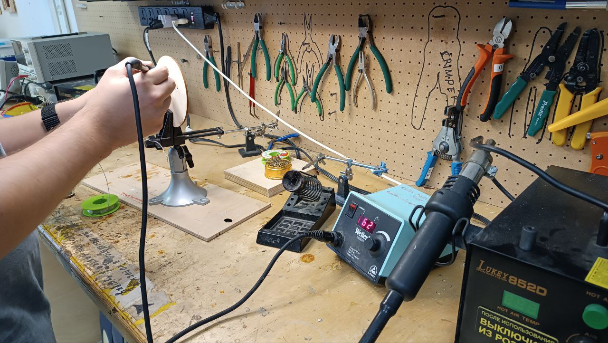
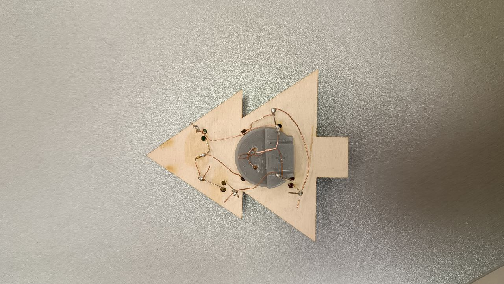
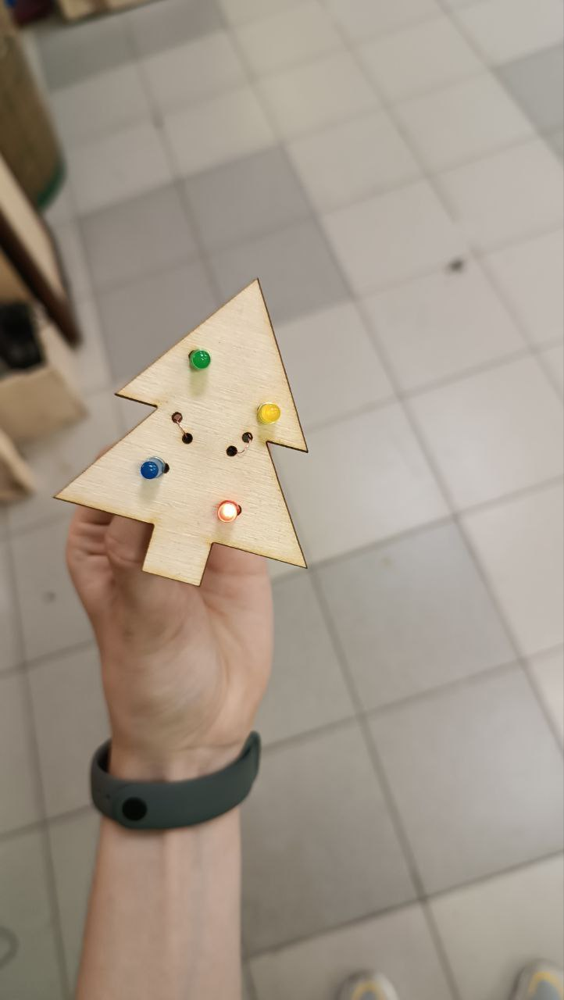

# Christmas-tree

**Создание кастомного брелока со встроенными светодиодными лампочками**
--------------------------
*Оборудование: 
3D-принтер Prusa i3 MK3,
Лазерный гравер GCC Spirit GLS100,
Сверлильный станок Bosch PBD 40,
Паяльник*

**При использовании паяльника и сверлильного станка надеваются защитный очки!**

*Материалы и элементы:
Фанерный лист,
PLA (полилактид),
Светодиоды,
Медный провод,
Припой (олово),
Батарейка CR2032 (2V)*

*Программное обеспечение:
PrusaSlicer,
CorelDraw,*

*Cервис готовых моделей для 3D печати - [Thingiverse](https://www.thingiverse.com/)*

Ход работы:

1. Вид будущей елки был нарисован с помощью программы CorelDraw. Изображение включало в себя отверстия под катод и анод для светодиодных ламп и отверстия для держателя батарейки.
2. Модель держателя CR2023 была взята из сериса Thingiverse и обработана в PrusaSlicer для дальнейшей печати.

3. Заготовка елки была вырезана с помощью лазерного гравера из фанерного листа.
4. Держатель был напечатан на 3D-принтере, а неполучившиеся отверстия для крепежа были проделаны с помощью сверлильного станка.

5. Электрическая цепь была собрана проведением проводов от батарейки к лампам и спаяна.

**Что получилось в итоге**

Недочеты в работе:
1. В напечатанный держатель батарейка вставлялась с трудом и не до конца.
2. Электрическая цепь светодиоды-батарейка была собрана неверно: параллельным соединением (не надо так с диодами)
и без использования резисторов. Вероятно, на 4 светодиодных лампы нужно использовать 2 батарейки.
